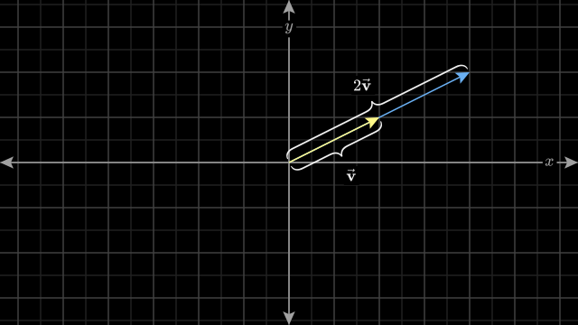

<center>
<iframe width="560" height="315" src="https://www.youtube.com/embed/0AWdezwHRY0?si=VhIDHwGiUGmAqOSn" title="YouTube video player" frameborder="0" allow="accelerometer; autoplay; clipboard-write; encrypted-media; gyroscope; picture-in-picture; web-share" referrerpolicy="strict-origin-when-cross-origin" allowfullscreen></iframe>
</center>

> ##### Vektor
>
> sonlarning tartiblangan ro'yxati.
{: .block-tip }

Vektorlar odatda kvadrat yoki oddiy qavslar bilan o'ralgan massivlar bo'lib ular vertikal ravishda yoziladi:

$$ \begin{bmatrix} -1.1 \\ 0.0 \\ 3.6 \end{bmatrix} \begin{pmatrix}-1.1 \\ 0.0 \\ 3.6 \end{pmatrix} $$

Ular vergul bilan ajratilgan va qavslar bilan o'ralgan raqamlar shaklida ham yozilishi mumkin:

$$ (-1.1, 0.0, 3.6) $$

Umuman olganda, $n$ ta elementdan iborat vektor $\mathbf{x}$ quyidagi ko'rinishda yoziladi:

$$ \mathbf{x} = \begin{bmatrix} x_1 \\ x_2 \\ \vdots \\ x_n \end{bmatrix} $$

- $x_i$ - vektorning $i$-chi elementi

> ##### Diqqat!
>
>Butun darsda vektorlar $\mathbf{v}$ qalinlashtirilgan shaklda bilan ko'rsatiladi.
>Sonlar esa $v$ kursiv shaklda ko'rsatiladi.
{: .block-warning }

Vektorning geometrik tushunchasi esa, vektorning nuqtadan boshlab boshqa nuqta yo'nalishini ko'rsatadi.
<center>
    
</center>
<small>Manba: [3blue1brown](https://www.3blue1brown.com/)</small>

<br>

```python
import numpy as np

# Vektor yaratish
vektor = np.array([-1.1, 0.0, 3.6])
print(vektor)

# Vektorning o'lchami
print(vektor.shape)

# Vektorning elementlari
print(vektor[0], vektor[1], vektor[2])
```

1.1 Vektor ustida amallar
-------------

Chiziqli algebraning yuragida ikkita vektor ustida amallar bor. Bular:
- qo'shish
- songa ko'paytirish

### 1.1.1 Vektorlarni Qo'shish

Ikkita vektorni (masalan, $\mathbf{v}$ va $\mathbf{w}$ ) bir biriga qo'shish uchun ularning mos elementlarini qo'shish kerak.


$$ \mathbf{v} = \begin{bmatrix} v_1 \\ v_2  \end{bmatrix} \quad \text{va} \quad \mathbf{w} = \begin{bmatrix} w_1 \\ w_2 \end{bmatrix}, \quad \mathbf{v} + \mathbf{w} = \begin{bmatrix} v_1 \\ v_2 \end{bmatrix} + \begin{bmatrix} w_1 \\ w_2  \end{bmatrix} = \begin{bmatrix} v_1 + w_1 \\ v_2 + w_2 \end{bmatrix} $$

 Misol uchun, ikkita vektorning qo'shish amali quyidagicha:

$$ \mathbf{v} = \begin{bmatrix} 1 \\ 2  \end{bmatrix} \quad \text{va} \quad \mathbf{w} = \begin{bmatrix} 4 \\ 5 \end{bmatrix}, \quad \mathbf{v} + \mathbf{w} = \begin{bmatrix} 1 \\ 2 \end{bmatrix} + \begin{bmatrix} 4 \\ 5  \end{bmatrix} = \begin{bmatrix} 5 \\ 7 \end{bmatrix} $$

> ##### Diqqat!
>
>Faqat bir hil o'lchamli vektorlarni qo'shish mumkin
{: .block-warning }


<center>
    
</center>
<small>Manba: [3blue1brown](https://www.3blue1brown.com/)</small>


<br>

```python
import numpy as np

# Vektor yaratish
vektor1 = np.array([-1.1, 0.0, 3.6])
vektor2 = np.array([1.1, 0.0, 3.6])

# Vektorlarni qo'shish
vektor3 = vektor1 + vektor2
print(vektor3)
```

### 1.1.2 Vektorlarni songa ko'paytirish

Vektorni ma'lum bir songa ($\alpha \in \mathbb{R}$) ko'paytirish uchun, vektorning har bir elementini ushbu songa ko'paytiramiz.

$$ \mathbf{v} = \begin{bmatrix} v_1 \\ v_2  \end{bmatrix} \quad \text{va} \quad \alpha, \quad \alpha \cdot \mathbf{v} = \alpha \cdot \begin{bmatrix} v_1 \\ v_2  \end{bmatrix} = \begin{bmatrix} \alpha \cdot v_1 \\ \alpha \cdot v_2 \end{bmatrix} $$


Misol uchun:

$$ \mathbf{v} = \begin{bmatrix} 1 \\ 2  \end{bmatrix}, \quad \alpha = 3, \quad \alpha \cdot \mathbf{v} = 3 \cdot \begin{bmatrix} 1 \\ 2  \end{bmatrix} = \begin{bmatrix} 3 \\ 6 \end{bmatrix} $$

<center>
    
</center>
<small>Manba: [3blue1brown](https://www.3blue1brown.com/)</small>


```python
import numpy as np

vektor = np.array([-1.1, 0.0, 3.6])
alpha = 3.0

# Vektorlarni songa ko'paytirish
vektor_scaled = alpha * vektor
print(vektor_scaled)
```

1.2 Vektor Normalari va Skalyar Ko'paytirish
-------------
Vektorlarning songa ko'paytirish va qo'shish amallarini o'rganishdan keyin, vektorlarning normalari va skalyar ko'paytirishini o'rganamiz.


<br>


### 1.2.1 Vektorlarni Skalyar Ko'paytirish

Bizda  $\mathbf{a} = \begin{bmatrix} a_1 & a_2 & ... & a_n \end{bmatrix}$ va $\mathbf{b} = \begin{bmatrix} b_1 & b_2 & ... & b_n \end{bmatrix}$ vektorlar bor.

Ularning skalyar ko'paytmasi:

$$ \boxed{\mathbf{a} \cdot \mathbf{b} = a_1 b_1 + a_2 b_2 + \ldots + a_n b_n}$$

$$ = \sum_{i=1}^{n} a_i b_i$$

$$ = \mathbf{a}^T \mathbf{b}$$


Misol: agar $\mathbf{a} = \begin{bmatrix} 1 & 2 & 3 \end{bmatrix}$ va $\mathbf{b} = \begin{bmatrix} 4 & 5 & 6 \end{bmatrix}$ bo'lsa,
$$\mathbf{a} \cdot \mathbf{b} = 1 \cdot 4 + 2 \cdot 5 + 3 \cdot 6 = 4 + 10 + 18 = 32$$


```python
import numpy as np

vektor1 = np.array([1, 2, 3])
vektor2 = np.array([4, 5, 6])

# Skalyar ko'paytirish
skalyar = np.dot(vektor1, vektor2)

# yoki
skalyar = vektor1 @ vektor2

print(skalyar)
```

### 1.2.2 Vektor Normasi

Berilgan ${\displaystyle p\geq 1}$ haqiqiy soni uchun, $\mathbf{v} = \begin{bmatrix} v_1 & v_2 & \ldots & v_n \end{bmatrix}$ vektorning $p$-normasi quyidagi ko'rinishda aniqlanadi:

$$\boxed{\| \mathbf{v} \|_p = \left( \sum_{i=1}^{n} |v_i|^p \right)^{1/p}}$$

Ko'p qo'llaniladigan normalar bular:
- $p = 1$ - Manhettan uzunligi yoki $\ell_1$ normasi

$$\| \mathbf{v} \|_1 = |v_1| + |v_2| + \ldots + |v_n| = \sum_{i=1}^{n} |v_i|$$

- $p = 2$ - Evklid uzunligi yoki $\ell_2$ normasi

$$\| \mathbf{v} \|_2 = \sqrt{v_1^2 + v_2^2 + \ldots + v_n^2} = \sqrt{\sum_{i=1}^{n} v_i^2}$$

- $p = \infty$ - Maksimum normasi yani vektorning eng katta elementi $\max$ operatori orqali aniqlanadi. 

$$\| \mathbf{v} \|_{\infty} = \max \{ |v_1|, |v_2|, \ldots, |v_n| \}$$


```python
import numpy as np

vektor = np.array([1, 2, 3])
l1_norma = np.linalg.norm(vektor, ord=1) # L1 norma
l2_norma = np.linalg.norm(vektor, ord=2) # L2 norma
l_inf_norma = np.linalg.norm(vektor, ord=np.inf) # L-inf norma

```


### 1.2.3 Vektor Normalari Amalda Qo'llanilishi

Birlik vektor (normalangan vektor):

$$ \boxed{\mathbf {\hat {u}} ={\frac {\mathbf {u} }{\|\mathbf {u} \|}}}$$

va uzunligi 1 ga teng bo'lgan vektor $$\|\mathbf {\hat {u}} \| = 1$$

```python
import numpy as np

vektor = np.array([1, 2, 3])
birlik_vektor = vektor / np.linalg.norm(vektor)
print(birlik_vektor)
print("uzunligi:", np.linalg.norm(birlik_vektor))
```


Masofa (Distance) formulasi:

$$\boxed{d(\mathbf{v}, \mathbf{w}) = \| \mathbf{v} - \mathbf{w} \|}$$


Ikki vektor orasidagi burchak (Angle between vectors) formulasi:

$$\boxed{\cos \theta = \frac{\mathbf{v} \cdot \mathbf{w}}{\| \mathbf{v} \| \| \mathbf{w} \|}}$$


```python
import numpy as np

vektor1 = np.array([1, 2, 3])
vektor2 = np.array([4, 5, 6])

# Masofa
masofa = np.linalg.norm(vektor1 - vektor2)

# Kosinus burchak
cos_theta = np.dot(vektor1, vektor2) / (np.linalg.norm(vektor1) * np.linalg.norm(vektor2))
```


1.3 Chiziqli kombinatsiya va Chiziqli bog'liqlik
-------------

### 1.3.1 Chiziqli Kombinatsiya

Agar $\mathbf{v_1}, \mathbf{v_2}, \ldots, \mathbf{v_n}$ vektorlar va $\alpha_1, \alpha_2, \ldots, \alpha_n$ skalyar sonlar bo'lsa, ularning chiziqli kombinatsiyalari yangi vektor:

$$\boxed{\mathbf{v} = \alpha_1 \mathbf{v_1} + \alpha_2 \mathbf{v_2} + \ldots + \alpha_n \mathbf{v_n}}$$


### 1.3.2 Chiziqli Bog'liqlik


Deylik $\mathbf{v}_1, \mathbf{v}_2, \ldots, \mathbf{v}_n$ vektorlar to'plami. Agar $\alpha_1, \alpha_2, \ldots, \alpha_n$ skalyarlar bo'lsa va:

$$\boxed{\alpha_1 \mathbf{v}_1 + \alpha_2 \mathbf{v}_2 + \ldots + \alpha_n \mathbf{v}_n = \mathbf{0}}$$

bunda faqat $\alpha_1 = \alpha_2 = \ldots = \alpha_n = 0$ shartni qanoatlantirsa, 

$\mathbf{v}_1, \mathbf{v}_2, \ldots, \mathbf{v}_n$ vektorlar **bog'liq emas** deb ataladi. 

Aks holda, ular **bog'liq** deb ataladi.