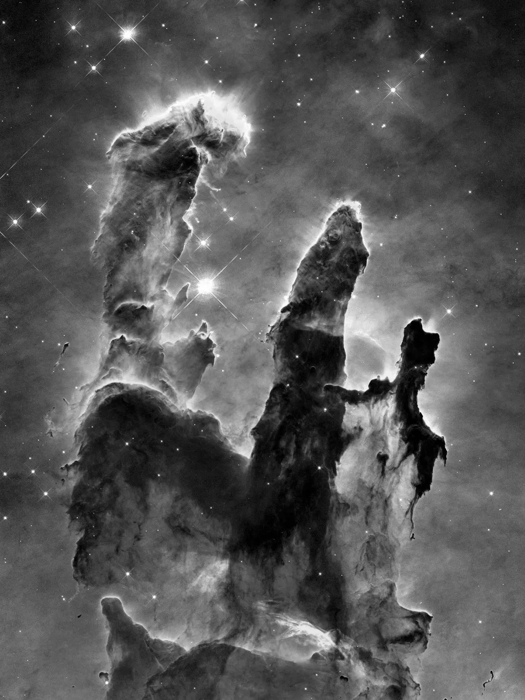

Vazifa 1: Vektorlar va Vektor Algebra
-------------

### 1.1 Vektor ustida amallar


Agar $$\textbf{u}= \begin{bmatrix} 5 \\ 2 \\ 9 \end{bmatrix}$$ va $$\textbf{v}= \begin{bmatrix} 1 \\ -8 \\ 6 \end{bmatrix}$$, $c=0.5$ bo'lsa, quyidagilarni bajaring:

1. $\textbf{u} + \textbf{v}$
2. $\textbf{u} - \textbf{v}$
3. $c\textbf{u}$
4. $\textbf{v}$ uzunligi 
5. $\textbf{u}$ larining birlik vektori ko'rinishi

### 1.2 Vektor normasi va skalyar ko'paytma

Agar $$\textbf{u}= \begin{bmatrix} 1 \\ -1 \\ 2 \end{bmatrix}$$ va $$\textbf{v}= \begin{bmatrix} 3 \\ -1 \\ 4 \end{bmatrix}$$, quyidagilarni toping:

1. $\textbf{u}$ vektorining $L_1$ normasi
2. $\textbf{v}$ vektorining $L_2$ normasi
3. $\textbf{u} \cdot \textbf{v}$
4. $d(\textbf{u}, \textbf{v})$ (Evklid masofa)
5. $\textbf{u}$ va $\textbf{v}$ orasidagi burchak

### 1.3 Chiziqli kombinatsiya va bog'liqlik

Quyidagilarni aniqlang:

1. $$\textbf{u}= \begin{bmatrix} 1 \\ 2 \end{bmatrix}, \textbf{v}= \begin{bmatrix} 3 \\ 4 \end{bmatrix}, \textbf{w}= \begin{bmatrix} 5 \\ 6 \end{bmatrix}$$ chiziqli bog'liqmi?

2. $$\textbf{u}= \begin{bmatrix} 1 \\ 2 \end{bmatrix}, \textbf{v}= \begin{bmatrix} 3 \\ 4 \end{bmatrix}, \textbf{w}= \begin{bmatrix} 8 \\ 14 \end{bmatrix}$$ chiziqli bog'liqmi?


### 1.4 📌 Mini-Loyiha: Oddiy Film Tavsiya Qiluvchi Tizim


Tasavvur qiling siz Netflix  companiyasida ishlayapsiz. Ma'lumotlar bazasi:

| Film nomi         | Jangari ⚔️ | Romantik 💕 | Fantastika 🚀 | Drama 🎭 | Komediya 😂 |
|------------------|----------|-----------|--------------|----------|------------|
| **Sheryurak**    | 5        | 1         | 2            | 1        | 0          |
| **Titanik**      | 1        | 4         | 2            | 2        | 1          |
| **Avatar**       | 3        | 2         | 5            | 2        | 1          |
| **Buyuk Getsbi** | 1        | 2         | 3            | 4        | 0          |
| **Pushti Pantera** | 1      | 1         | 4            | 1        | 5          |

**Foydalanuvchi qiziqishlari**:
```python
[Jangari = 5, Romantik = 3, Fantastika = 1, Drama = 2, Komediya = 2]
```

🎯 **Maqsad**: Foydalanuvchining yoqtirgan kino janrlariga asoslanib, unga mos filmlarni tavsiya qilish.

-------


> ##### Google Colab da vazifani bajarishingiz mumkin!
>
> [**Vazifa 1: Vektorlar va Vektor ustida amallar**](https://colab.research.google.com/drive/1GTfQglVxzgAF2h5aPRuy_DD7g8YKZt_a?usp=sharing)
{: .block-warning }

-------

Vazifa 2: Matritsa Asoslari
-------------

### 2.1.1  Matritsani elementlarini o'zgartirish
Quyidagi berilgan matritsa elementlarini shunda o'zgartiringki, natijada berilgan kulgan smaylik rasmi chiqsin.
Izoh: siz pikselni o'zgartirishda, matritsa elementlarini o'zgartirish orqali rasmda o'zgarishni ko'rsatishingiz mumkin.
Buning uchun 0 va 1 sonlaridan foydalanishingiz mumkin. 0 - oq rang, 1 - qora rang.

```python
import numpy as np
import matplotlib.pyplot as plt

# < sizning kodlaringiz bu yerda yozing>
smile = np.zeros((16, 16), dtype=int)

# <pastdagi matritsa elementlarini o'zgartirng>
smile[4:6, 4:6] = 1
smile[4:6, 10:12] = 1
smile[10, 4:12] = 1
smile[11, 3:5] = 1
smile[11, 11:13] = 1


# Yaratilgan matritsa shunday ko'rinishda bo'lish kerak
plt.imshow(smile, cmap='gray')
```

### 2.1.2 Matritsa Yaratish

Quyidagi funksiyalardan foydalanib turli xil matritsalarni yarating:
```python
np.random.randint(a, b, (m, n)) # a va b orasidagi tasodifiy sonlar bilan to'ldirilgan m x n matritsa
np.zeros((m, n)) # nol elementlar bilan to'ldirilgan m x n matritsa
np.ones((m, n)) # bir elementlar bilan to'ldirilgan m x n matritsa
```

1. 5 x 100 elementlarini 0 va 50 orasidagi tasodifiy sonlar bilan to'ldirilgan matritsa
2. 100 x 5 nol elementlar bilan to'ldirilgan matritsa
3. 5 x 5 bir elementlar bilan to'ldirilgan matritsa

### 2.2 Matritsa Ustida Amallar

Quyidagi matritsalarni yaratib, ular ustida amallar bajarib ko'ring:

1. $$A = \begin{bmatrix} 1 & 2 \\ 3 & 4 \end{bmatrix}$$, $$B = \begin{bmatrix} 5 & 6 \\ 7 & 8 \end{bmatrix}$$ matritsalarni yarating.
2. $A + B$ va $A - B$ amallarini toping
3. $A B$ amalini toping
4. $A \textbf{v}$ amalini toping, $$\textbf{v} = \begin{bmatrix} 1 \\ 2 \end{bmatrix}$$
5. $A B \textbf{v}$ amalini toping
6. $A \odot B $ amalini toping
7. $A^T$ va $B^T$ amallarini toping
8. $A \odot B^T$ amalini toping
9. $A^T B$ amalini toping
10. $A^T B^T$ amalini toping
11. $\text{tr}(A)$ va $\text{tr}(B)$ amallarini toping
12. $\text{tr}(A B)$ va $\text{tr}(B A)$ amallarini toping
13. $\text{tr}(A B^T)$ va $\text{tr}(B^T A)$ amallarini toping
14. $\text{tr(A - B)}$ va $\text{tr(A) - tr(B)}$ tengliklarini tekshiring


### 2.3 🎨 **Mini-Loyiha: Tasvirni Manipulyatsiya Qilish** 🖼️

**🎯 Maqsad**  
Berilgan tasvir ustida **matritsa amallari** yordamida ishlov berish va uni **kulrang tasvirga (grayscale)** aylantirish.

---

**📌 Tasvir va Matritsa Tushunchasi**  
Rangli tasvir (RGB) **3 ta matritsadan** iborat:  
🔴 **R (Red)** – Qizil rang matritsasi  
🟢 **G (Green)** – Yashil rang matritsasi  
🔵 **B (Blue)** – Ko‘k rang matritsasi  

Har bir matritsa **0 dan 255 gacha** bo‘lgan qiymatlardan iborat bo‘lib, tasvirning har bir pikselini ifodalaydi.  
**Misol:** Quyidagi rangli tasvirni **uchta matritsaga** ajratish mumkin:


📷 **Tasvir haqida ma’lumot**:  
Bu rasm **Buxoro amiri Muhammad Olimxon (1880–1944)** ga tegishli bo‘lib, 1911-yilda Sergey Prokudin-Gorskiy tomonidan olingan.  
Surat uch xil **ko‘k, yashil va qizil (RGB)** filtrlar yordamida tushirilgan va keyinchalik rangli tasvirga aylantirilgan.

---
**📌 Kulrang Tasvir (Grayscale)**
Kulrang tasvirda faqat **yorug‘lik intensivligi** saqlanadi, ranglar esa yo‘qoladi.  
Tasvirni kulrangga aylantirish uchun quyidagi formuladan foydalanamiz:  

$$
Y = 0.299 \cdot R + 0.587 \cdot G + 0.114 \cdot B
$$

Bu yerda:  
✅ **Y** – Yorug‘lik intensivligi matritsasi (grayscale)  
✅ **R, G, B** – Qizil, yashil va ko‘k ranglar matritsalari  

---

**📌 Qadamlar**
🛠️ **1. Tasvirning maksimum va minimum piksel qiymatlarini topish**  
   - `np.max()` va `np.min()` funksiyalaridan foydalaning.  

📏 **2. Tasvir o‘lchamini aniqlash**  
   - Tasvir matritsasining **qator, ustun va kanallar sonini** toping.  

🌈 **3. Tasvirni RGB kanallariga ajratish**  
   - Har bir rang matritsasini ajratish uchun `img[:, :, i]` indekslashdan foydalaning.  

📊 **4. Har bir rang matritsasini [0,1] oralig‘iga normallashtirish**  
   - **Formula**:  
    $$
     I = \frac{X - X_{min}}{X_{max} - X_{min}}
    $$

⚫ **5. Tasvirni "Grayscale" ga o‘tkazish**  
   - **Formula**:  
     $$
     Y = 0.299 \cdot R + 0.587 \cdot G + 0.114 \cdot B
     $$
   - O‘lchamni o‘zgartirmasdan, ranglarni intensivlikka aylantiring.  

---

🎯 **Natija**: Siz tasvirni **matritsalar asosida tahlil qilish** va uni **kulrang formatga o‘tkazish** bo‘yicha bilim va tajriba olasiz! 🚀 

-------


> ##### Google Colab da vazifani bajarishingiz mumkin!
>
> [**Vazifa 2: Matritsa Asoslari**](https://colab.research.google.com/drive/1Ql_fE5xR_Lys8y9Wq3DYCFTH0Hr_sKOU?usp=sharing)
{: .block-warning }


-------

Vazifa 3: Transformatsiya va Chiziqli Tenglamalar Tizimi
-------------

### Vazifa 3.1.1 Chiziqli Transformatsiya (Linear Transformation)

Quyidagi funksiyalardan qaysinisi chiziqli transformatsiya (linear transformation) hisoblanadi?
1. $f_1: \mathbb{R}^2 \to \mathbb{R}^2, f_1(x, y) = (x, -y)$
2. $f_2: \mathbb{R}^3 \to \mathbb{R}^3, f_2(x, y, z) = (xy, x, y)$

### Vazifa 3.1.2 Chiziqli Transformatsiyalarni amalga oshirish

1. siljish (shear) y-o'qi bo'yicha $m = 1.5$
2. aks (reflection) y o'qiga nisbatan
3. siqish (squeeze) y o'qiga nisbatan $k = 0.2$ va x o'qiga nisbatan $l = 0.5$
4. masshtablash (scaling) $s = 2$
5. aylantirish (rotation) $\theta = 45^\circ$

```python

import numpy as np
import matplotlib.pyplot as plt

transformations = {
    'Siljish': , # matritsa yozing
    'Aks': , # matritsa yozing
    'Siqish': , # matritsa yozing
    'Masshtablash': , # matritsa yozing
    'Aylantirish 45°': # matritsa yozing
}


x = np.array([[1], [1]])
fig, axs = plt.subplots(1, 5, figsize=(12, 3))

for ax, (title, A) in zip(axs.flatten(), transformations.items()):
    y = A @ x
    ax.quiver(0, 0, x[0], x[1], angles='xy', scale_units='xy', scale=1, color='blue', label='Original Vektor')
    ax.quiver(0, 0, y[0], y[1], angles='xy', scale_units='xy', scale=1, color='red', label='O\'zgargan Vector')
    ax.set_xlim(-3, 3)
    ax.set_ylim(-3, 3)
    ax.axhline(0, color='black', linewidth=0.5)
    ax.axvline(0, color='black', linewidth=0.5)
    ax.grid(True)
    ax.set_title(title)

plt.legend()
plt.tight_layout()
plt.show()
```

### Vazifa 3.2.1: Chiziqli Tenglamalar Tizimini yechish
Berilgan chiziqning tenglamalar tizimini yeching:
1. Gauss usuli orqali

$$\begin{cases}
x_1 + x_2 - 2x_3 = 1 \\
2x_1 - 3x_2 + x_3 = -8 \\
3x_1 + x_2 + 4x_3 = 3
\end{cases}$$

2. Teskari matritsa orqali

$$\begin{cases}
x + 2y = 4 \\
3x − 5y = 2
\end{cases}$$


### 3.3 🏦 **Mini-Loyiha: Iqtisodiy Tarmoqlararo Muvozanat** 📊  

🎯 **Maqsad**  
Leontief Kirim-Chiqim Modeli yordamida **iqtisodiy tarmoqlarning o‘zaro bog‘liqligini** tahlil qilish va **ishlab chiqarish talablarini bashorat qilish**.  

---

**📖 Leontief Kirim-Chiqim Modeli**  
Bu model **iqtisodiyotdagi tarmoqlar o‘rtasidagi resurs almashinuvini** ifodalaydi.  
Har bir tarmoq:  
✅ O‘z mahsulotining bir qismini boshqa tarmoqlarga yetkazib beradi.  
✅ Ishlab chiqarish jarayonida boshqa tarmoqlarning mahsulotlaridan foydalanadi.  

👨‍💼 **Misol**: Sizda uchta iqtisodiy tarmoq mavjud:  
- 🌾 **Qishloq xo‘jaligi**  
- 🏭 **Sanoat**  
- 🏢 **Xizmatlar**  

Har bir tarmoq o‘z ishlab chiqarish jarayonida **boshqa tarmoqlarning mahsulotlariga ehtiyoj sezadi**.  
Quyidagi jadval **1 milliard so‘mlik mahsulot ishlab chiqarish uchun boshqa tarmoqlardan qancha xarajat talab qilinishini** ko‘rsatadi:  

| **Tarmoq** | 🌾 Qishloq xo‘jaligi | 🏢 Xizmatlar | 🏭 Sanoat |
|------------|----------------------|-------------|----------|
| **🌾 Qishloq xo‘jaligi** | 0.01 | 0.002 | 0.04 |
| **🏢 Xizmatlar** | 0.02 | 0.004 | 0 |
| **🏭 Sanoat** | 0 | 0.01 | 0.02 |

🔹 **Tushuntirish**:  
Masalan, **1 milliard so‘mlik** tovar ishlab chiqarish uchun:  
- **Qishloq xo‘jaligi** 0.01 milliard so‘m **o‘ziga**, 0.002 milliard so‘m **xizmatlarga**, va 0.04 milliard so‘m **sanoatga** sarflash kerak.  

---

**📌 Talab Vektori**  
Davlat har bir tarmoq uchun **yakuniy talab miqdorini** belgilaydi:  
- **Qishloq xo‘jaligi** → **100 milliard so‘m**  
- **Xizmatlar** → **200 milliard so‘m**  
- **Sanoat** → **300 milliard so‘m**  

---

**❓ Savol**  
Har bir tarmoq uchun **umumiy ishlab chiqarish hajmi** qancha?  

---

**📌 Yechim: Leontief Kirim-Chiqim Modeli**  
Leontief modeliga ko‘ra, **ishlab chiqarish vektori** ($\mathbf{x}$) quyidagi tenglama orqali aniqlanadi:  

$$
\mathbf{x} = \mathbf{A} \mathbf{x} + \mathbf{y}
$$

Bu yerda:  
✅ **$\mathbf{x}$** – ishlab chiqarish hajmi vektori  
✅ **$\mathbf{y}$** – yakuniy talab vektori  
✅ **$\mathbf{A}$** – iste’mol matritsasi  

---

**📌 Qadamlar**  
1. **Iste'mol matritsa ($\mathbf{A}$) va talab vektori ($\mathbf{y}$) ni yaratish**  
2. **Ishlab chiqarish hajmini ($\mathbf{x}$) aniqlash**
3. **Chiziqli tenglamani yechish**

-------


> ##### Google Colab da vazifani bajarishingiz mumkin!
>
> [**Vazifa 3: Chiziqli Transformatsiya**](https://colab.research.google.com/drive/1KnSM0wXSeYPoIljGCulBmtjyRHvXy1Tq?usp=sharing)
{: .block-warning }

-------

Vazifa 4: Vektor Fazolar va Ortogonalizatsiya
-------------

### Vazifa 4.1.1 Bazis va Subfazolar

1. $$\left \{ \begin{bmatrix} 1 \\ -2 \\ -1 \end{bmatrix}, \begin{bmatrix} 2 \\ -3 \\ 1 \end{bmatrix}, \begin{bmatrix} 5 \\ -8 \\ 1 \end{bmatrix} \right \}$$  vektorlar to'plami $R^3$ fazoga bazis bo'la oladimi?
2. $V$ subfazo hisoblanadimi?
- $$V = \left \{ \begin{bmatrix} a \\ b \end{bmatrix} \in \mathbb{R}^2; 2a=3b \right \}$$
- $$V = \left \{ \begin{bmatrix} a \\ b \end{bmatrix} \in \mathbb{R}^2; ab=0 \right \}$$


### Vazifa 4.1.2: Matritsa Rangi
Ushbu matritsalarni rangini aniqlang:

- $$ \begin{bmatrix} 3 & -1 \\ 1 & 3 \end{bmatrix} $$   
- $$ \begin{bmatrix} 1 & 2 & 1 \\ -2 & -3 & 1 \\ 3 & 5 & 0 \end{bmatrix}$$

### Vazifa 4.2: Ortogonallik va Proeksiya


1. Ushbu vektorlar ortogonalmi?
  - $$\begin{bmatrix} 1 \\ 2 \\ 3 \end{bmatrix}$$ va $$\begin{bmatrix} 4 \\ 5 \\ 6 \end{bmatrix}$$
  - $$\begin{bmatrix} -1 \\ 1\\ 0 \end{bmatrix}$$ va $$\begin{bmatrix} 1 \\ 1 \\ -1 \end{bmatrix}$$

2. $$\mathbf{u}$$ vektorni $$\mathbf{v}$$ vektordagi proeksiyasini toping, agar:
  - $$\mathbf{u} = \begin{bmatrix} 1 \\ 2 \end{bmatrix}$$ va $$\mathbf{v} = \begin{bmatrix} 3 \\ 4 \end{bmatrix}$$ 
  - $$\mathbf{u} = \begin{bmatrix} 1 \\ 2 \\ 3 \end{bmatrix}$$ va $$\mathbf{v} = \begin{bmatrix} 3 \\ 4 \\ 5 \end{bmatrix}$$

3. $$\mathbf{v}$$ vektorni $$\{ \mathbf{u}_1, \mathbf{u}_2 \}$$ basiz vektorlardan tashkil topgan subfazoga proyeksiyasini toping, agar:
  - $$\mathbf{u}_1 = \begin{bmatrix} 1 \\ 1 \\ 1 \end{bmatrix}$$, $$\mathbf{u}_2 = \begin{bmatrix} 0 \\ 1 \\ 2 \end{bmatrix}$$ va $$\mathbf{v} = \begin{bmatrix} 6 \\ 0 \\ 0 \end{bmatrix}$$


### 4.3 🏘️ **Mini-Loyiha: Sotuv Miqdorini Modellashtirish (Chiziqli Model)** 📊

🎯 **Maqsad**  
Toshkent shahridagi kvartira narxlari va ularning maydoni (m²) o‘rtasidagi bog‘liqlikni tahlil qilish, va **chiziqli model** asosida **kelajakdagi uy narxini bashorat qilish**.

---

#### **📖 Voqea Tavsifi**  
Sizga Toshkentdagi turli hududlarda joylashgan kvartiralarning **maydoni (m²)** va ularning **narxi (ming dollar)** bo‘yicha ma’lumotlar berilgan.  
Ma’lumotlarni o‘rganish natijasida aniqlanganki, narx odatda **maydon oshishi bilan chiziqli ravishda ortib boradi**.


Shunday qilib, quyidagi chiziqli model taklif qilinadi: 
$$
y = c_0 + c_1 x
$$

Bu yerda:  
- $y$ — kvartiraning narxi (ming dollar)  
- $x$ — kvartira maydoni (m²)  
- $c_0$ — boshlang‘ich narx (asosiy xizmatlar, joylashuv, va h.k.)  
- $c_1$ — har bir kvadrat metr uchun narx (ming dollar/m²)

Sizga bir nechta kuzatish nuqtalari berilgan:  

$$
(x_0, y_0),\ (x_1, y_1),\ \dots,\ (x_n, y_n)
$$


Modelni quyidagi matritsa ko‘rinishida yozamiz:

$$
A =
\begin{bmatrix}
1 & x_0 \\
1 & x_1 \\
\vdots & \vdots \\
1 & x_n
\end{bmatrix}
,\quad
\mathbf{y} =
\begin{bmatrix}
y_0 \\
y_1 \\
\vdots \\
y_n
\end{bmatrix}
,\quad
\mathbf{c} =
\begin{bmatrix}
c_0 \\
c_1
\end{bmatrix}$$

Model tenglamasi:  
$$ A \mathbf{c} \approx \mathbf{y} $$

---

#### Eng kichik kvadratlar usuli (Least Squares Method)

Chiziqli model parametrlarini aniqlash uchun **eng kichik kvadratlar usulidan** foydalanamiz:

$$
\boxed{\mathbf{c} = (A^T A)^{-1} A^T \mathbf{y}}
$$


### **📌 Amalga oshirish Qadamlar**

1️⃣ $A$ matritsani yarating (ustunlar: 1 va $x$)  
2️⃣ Hisoblang:  
   - $A^T A$  
   - $A^T \mathbf{y}$  
   - $(A^T A)^{-1}$  


3️⃣ Quyidagi formula orqali $\mathbf{c}$ ni toping:
$$
   \mathbf{c} = (A^T A)^{-1} A^T \mathbf{y}
$$

---

🎯 **Natija**: Siz ma’lumotlardan foydalangan holda **chiziqli regressiya modelini** yaratishni va eng kichik kvadratlar yordamida uning koeffitsiyentlarini aniqlashni o‘rganasiz — bu ma’lumot tahlili va mashinaviy o‘rganishning asosiy vositalaridan biridir. 🚀  

-------


> ##### Google Colab da vazifani bajarishingiz mumkin!
>
> [**Vazifa 4: Vektor Fazolar va Ortogonalizatsiya**](https://colab.research.google.com/drive/1dwm_sHCehMcRROgbQ0vtfVdWjZsswnpq?usp=sharing)
{: .block-warning }


-------

Vazifa 5: Ilg'or Matritsa tushunchalari
-------------

### Vazifa 5.1.1 Determinant topish

Ushbu matritsalarning determinantlarini toping:
$$\mathbf{A} = \begin{bmatrix} 4 & -2 \\ 1 & -9 \end{bmatrix} \quad \quad \mathbf{B} = \begin{bmatrix} 4 & 5 & 3 \\ 1 & 2 & 3 \\ 1 & 2 & 3 \end{bmatrix}$$

### Vazifa 5.1.2: Matritsaning normasini topish
Agar $$\mathbf{A} = \left[ \begin{array}{rr} -5 & 2 \\ -7 & 4 \end{array} \right]$$, uning quyidagi normalarini toping:
    - Frobenius normasini
    - Maksimum norm  normasini
    - Sprektral norm  normasini 

### Vazifa 5.1.3: Matritsani yoyish
Agar $$\mathbf{A} = \left[ \begin{array}{rr} 4 & 1 \\ 2 & 3 \end{array} \right]$$, uni
    - $\textbf{LU}$ yoying
    - $\textbf{QR}$ yoying
    - $Eigen$ yoying


### 5.2 🌌 Mini-Loyiha: Tasvirini Kompreslash 
🎯 **Maqsad**  
Singular yoyish (SVD) yordamida tasvirni **hajm jihatidan siqish** va faqat eng muhim komponentlar bilan **tiklash sifatini tahlil qilish**.

---
<center></center>

Siz ishlayotgan tasvir — **Habbl kosmik teleskopi** tomonidan olingan mashhur **"Yaratilish ustunlari
"** manzarasining **kulrang (grayscale)** versiyasi. Bu tasvir o‘zining yuqori aniqligi va murakkab tuzilishi bilan ma’lum.

Ammo, rasm katta hajmi sababli, rasmni saqlash va uzatish uchun katta xotira va tezkor aloqa qurilmalar kerak bo'ladi. Lekin, tasvirni kompreslasak, ularga ehtiyoj sezilmaydi. 

Siz NASA'ga yordam berish uchun rasmni kompreslash algoritmini yaratishingiz kerak. 

**💡 SVD yordamida tasvirni kompresslash**

Tasvirni **matritsa** sifatida qarasak ($A \in \mathbb{R}^{m \times n}$), uni quyidagicha **Singular Yoyish** (SVD) orqali ifodalash mumkin:

$$\textbf{A} = \mathbf {U\Sigma V^{T}} = \Bigg[ \mathop{\color{red}{\mathbf u_1}} \limits_|^| \ \mathop{\color{red}{\mathbf u_2}} \limits_|^| \ \cdots \ \mathop{\mathbf u_m} \limits_|^| \Bigg] \left[\begin{array}{cccc|c}
\color{red}{\sigma_1} & & & \\
& \color{red}{\sigma_2} & & \\
& & \ddots & & \boldsymbol{0} \\
& & & \sigma_r & \\ \hline
& \boldsymbol{0} & & \boldsymbol{0}
\end{array} \right]_{m \times n} \Bigg[ \mathop{\color{red}{\mathbf v_1}} \limits_|^| \ \mathop{\color{red}{\mathbf v_2}} \limits_|^| \ \cdots \ \mathop{\mathbf v_n} \limits_|^| \Bigg] ^{T}$$


🔹 **Asosiy g‘oya**: Faqat eng muhim $k$ ta **singular qiymat ($\sigma_1, \dots, \sigma_k$)** va ularga mos ustun/qatordan foydalanib, matritsani **taxminiy tiklash** mumkin.  Masalan $k=2$ bo'lsa, biz qizil rangdagi vektor va singulyar qiymatlarni tanlab matritsaning qolgan qora rangdagi elementlarini tashlab yuborishimiz mumkin.


-------

🔧 **Qadamlar: Tasvirni kompresslash va tiklash**

1. `np.linalg.svd()` yordamida $A = U \Sigma V^T$ ga yoying  
2. Singulyar qiymatlarni `matplotlib` orqali grafik chizib tasvirlang
3. Quyidagi $k$ qiymatlar uchun tasvirni qayta tiklang: 
    - $k=1, 10, 20, 50, 100$
4. $k=100$ bo'lganida Kompresslash nisbatini toping
    - original rasm uchun qancha sonlar kerak
    - kompresslangan rasm uchun qancha sonlar kerak
    - qancha joy ortib qoldi: (org - komp) / org 

-------


> ##### Google Colab da vazifani bajarishingiz mumkin!
>
> [**Vazifa 5: Ilg'or Matritsa Tushunchalari**](https://colab.research.google.com/drive/1dwm_sHCehMcRROgbQ0vtfVdWjZsswnpq?usp=sharing)
{: .block-warning }